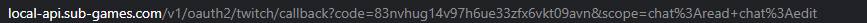

# sub-games-companion-backend
Backend code for 2 services running [https://www.sub-games.com](https://www.sub-games.com). 

* API Service - This is where the frontend code will reach out to make HTTP requests. This is a GraphQL service that is
meant to be public facing.
* Listener Service - This service handles responding to backend system-to-system events such a pub-sub or Twitch
IRC. This has a GraphQL API to accept requests from the API service, but this service should not be public facing.

## Architecture
### Listener Service
The listener service code is in [src/listener](src/listener). This service is responsible for listening to events that
happen in twitch such as pub sub and IRC.

#### IRC
In order for the listener service to connect to [Twitch IRC](https://dev.twitch.tv/docs/irc/guide) it needs an account to
connect with. In Production this is the `ReactiveSubGameBot` but locally it makes sense to use your own Twitch account or
create a bot of your own.

##### ReactiveSubGameBot
This bot is not a [known or verified](https://dev.twitch.tv/docs/irc/guide#known-and-verified-bots) bot yet,
but hopefully we can achieve that status in the future.

## Contributing

### Pull Requests
TODO

### Local Dev Environment
#### 1. Install Docker
We rely on [Docker](https://www.docker.com/) to make sure everyone has a similar developer experience by removing differences
between development environments. Docker also allows us to closely simulate a production environment which is the [goal](https://12factor.net/dev-prod-parity).

#### 2. Local SSL Certs
Web authentication uses [HTTP cookies](https://developer.mozilla.org/en-US/docs/Web/HTTP/Cookies) using the `secure` attribute
which means HTTPS is required. In order to keep our local environments as close to production as possible we require the setup
of local SSL certificates. This project already has certificates generated in the [docker-config/local/certs directory](docker-config/local/certs).

Although the certificates exist you must tell your OS to trust them as they are self-signed certs which are normally not
trusted by default.
* [Windows 10+](https://support.kaspersky.com/CyberTrace/1.0/en-US/174127.htm)
* [Mac OS X](https://css-tricks.com/trusting-ssl-locally-mac/#trusting-the-local-certificate-through-keychain)

You must also configure your hosts file to know that traffic to those local domains need to be routed to 127.0.0.1.
The entry in the hosts file will be similar across OSs, but the location of the host file will differ per OS.

i.e., Sample host entry
`127.0.0.1 localhost local-api.sub-games.com local.sub-games.com local-listener.sub-games.com`
[Instructions to edit hosts file](https://www.howtogeek.com/howto/27350/beginner-geek-how-to-edit-your-hosts-file/)

##### Generating New Local SSL Certs
Although you shouldn't need to do this because certificates have already been committed to this repository, in some cases
we may need to regenerate those certificates i.e., the old certificates expired.

You can run these commands similar to advice in [this article](https://letsencrypt.org/docs/certificates-for-localhost/).

* local-api.sub-games.com
```bash
openssl req -x509 -out docker-config/local/certs/local-api-sub-games-com.crt -keyout docker-config/local/certs/local-api-sub-games-com.key \
  -newkey rsa:2048 -nodes -sha256 \
  -subj '/CN=local-api.sub-games.com' -extensions EXT -config <( \
   printf "[dn]\nCN=local-api.sub-games.com\n[req]\ndistinguished_name = dn\n[EXT]\nsubjectAltName=DNS:local-api.sub-games.com\nkeyUsage=digitalSignature\nextendedKeyUsage=serverAuth")
```

* local-listener.sub-games.com
```bash
openssl req -x509 -out docker-config/local/certs/local-listener-sub-games-com.crt -keyout docker-config/local/certs/local-listener-sub-games-com.key \
  -newkey rsa:2048 -nodes -sha256 \
  -subj '/CN=local-listener.sub-games.com' -extensions EXT -config <( \
   printf "[dn]\nCN=local-listener.sub-games.com\n[req]\ndistinguished_name = dn\n[EXT]\nsubjectAltName=DNS:local-listener.sub-games.com\nkeyUsage=digitalSignature\nextendedKeyUsage=serverAuth")
```

_NOTE: If you regenerate these certs you must follow the instructs to make you OS trust them again._

#### 3. Create Twitch App
The name of the official production app is "Sub Games." You will not be able to use this app for local development though
as that would require we share the secret key for the app to everyone. You should [create your own app](https://dev.twitch.tv/console/apps/create)
for local development purposes.

#### 4. Create Twitch IRC Bot
The name of the official production Twitch bot is "ReactiveSubGameBot." Just like the Twitch app from step 3, you will
not be able to use the production bot for local development purposes. You should create a Twitch user to use as a bot
or just use your own user.

##### IRC Bot Credentials
In order to retrieve the credentials needed for whatever account your using as your Twitch IRC bot, you will need to visit
the below URL in a browser. The below URL is for the [OAuth2 authorization code flow](https://dev.twitch.tv/docs/authentication/getting-tokens-oauth#oauth-authorization-code-flow).
The scopes in the URL should ask you to approve this App to read and write to Twitch chat.

[Scopes](https://dev.twitch.tv/docs/authentication#scopes):
* chat:edit
* chat:read

1. URL to visit for access code
   https://id.twitch.tv/oauth2/authorize?client_id=<YOUR_APP_CLIENT_ID>&redirect_uri=<YOUR_APP_REDIRECT_URL>&response_type=code&scope=chat:read%20chat:edit

2. Its expected that once you approve the application from the step above that you will get an error page.
   This error page occurs because the system expects more data than provided but for our purposes this was good enough.
   You will need to `code` query parameter from the error page URL 

3. Using the code from step 2 you will need to make a POST request to the below URL to get an access and refresh token.
   https://id.twitch.tv/oauth2/token?client_id=<YOUR_APP_CLIENT_ID>&client_secret=<YOUR_APP_CLIENT_SECRET>&code=<CODE_FROM_STEP_2>&grant_type=authorization_code&redirect_uri=<YOUR_APP_REDIRECT_URL>
   
4. You will need to insert a user into the user database with the `isActiveBot` flag set to true. TODO write more documentation
on this.

#### 5. Start Project
You can now run `npm run start` which will launch the docker containers as well as output the logs of those
containers into your terminal. You should be able to visit [https://local-api.sub-games.com/graphql](https://local-api.sub-games.com/graphql)
and [https://local-listener.sub-games.com/graphql](https://local-listener.sub-games.com/graphql) and see the [GraphQL playground](https://www.apollographql.com/docs/apollo-server/testing/graphql-playground/)
to explore the API.
